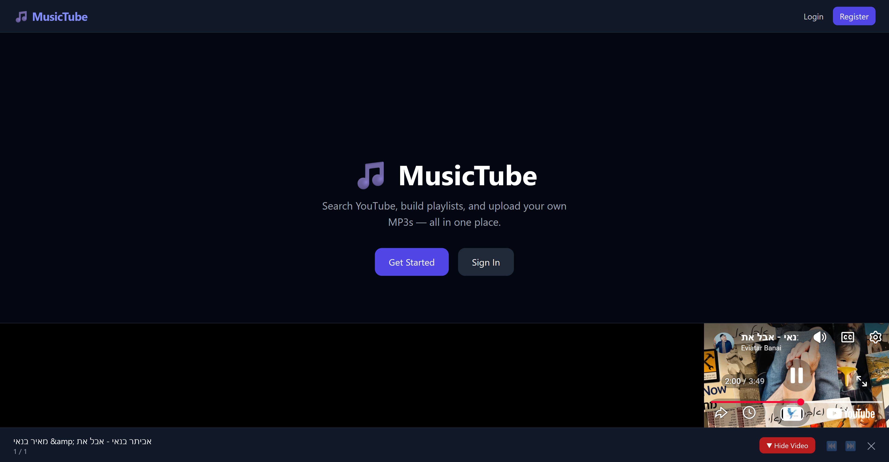
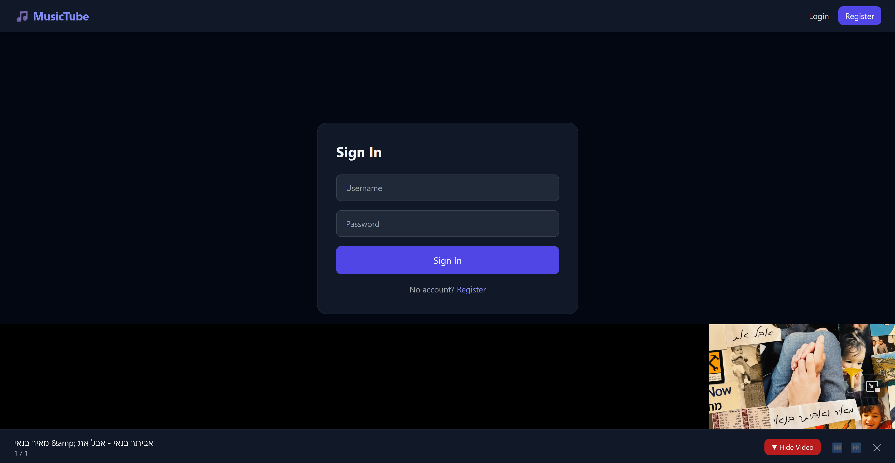
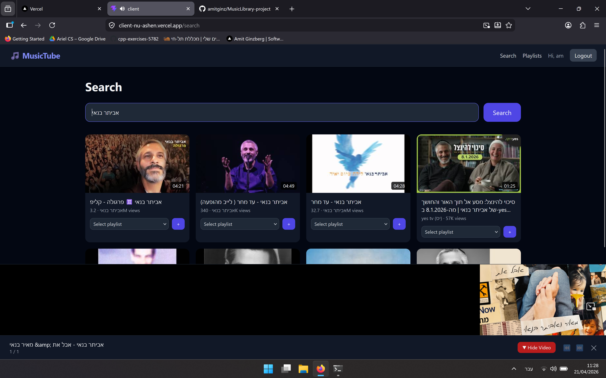
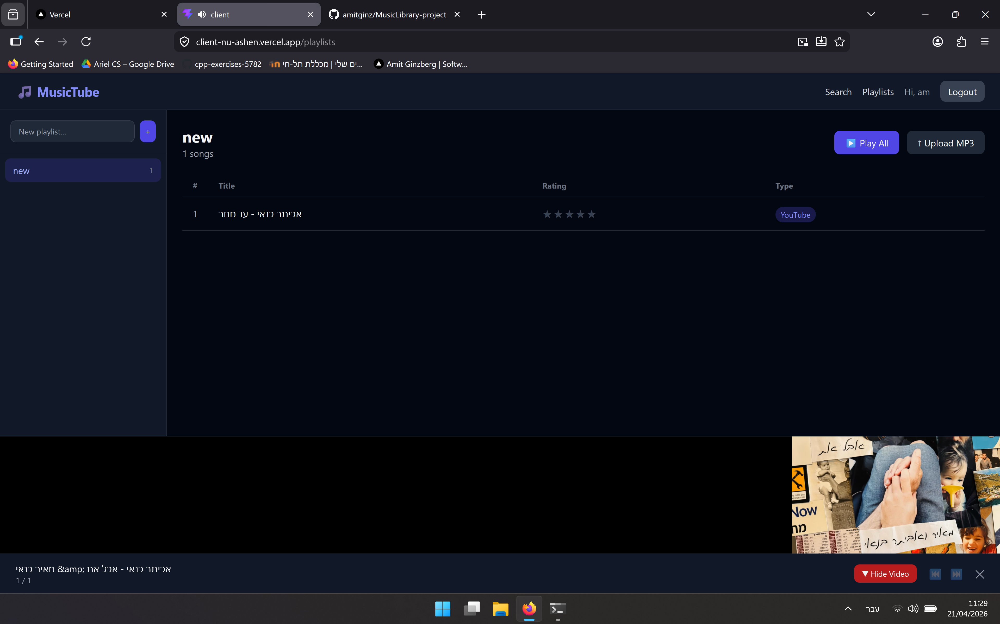

# MusicTube

A full-stack music management and streaming platform. Search songs via YouTube, manage personal playlists, and upload local MP3 files — all from one interface.

## Screenshots

| Home | Login |
|------|-------|
|  |  |

| Search | Playlists |
|--------|-----------|
|  |  |

## Features

- **Authentication** — JWT-based register/login with password hashing (bcryptjs)
- **YouTube Search** — Real-time song search via YouTube Data API v3
- **Playlist Management** — Create, rename, and delete personal playlists per user
- **MP3 Upload** — Upload local audio files; stored via Cloudinary
- **Media Player** — Unified player supporting YouTube IFrame and HTML5 Audio, with autoplay and clean teardown on close
- **Responsive UI** — Mobile-friendly design built with Tailwind CSS

## Tech Stack

### Frontend
| Tool | Purpose |
|---|---|
| React 19 + TypeScript | UI framework |
| Vite | Build tool & dev server |
| Tailwind CSS | Styling |
| Zustand | Global state management |
| TanStack React Query | Server state & caching |
| React Router v6 | Client-side routing |
| Axios | HTTP client |

### Backend
| Tool | Purpose |
|---|---|
| Node.js + Express | REST API server |
| TypeScript | Type safety |
| MongoDB + Mongoose | Database |
| JWT | Authentication |
| Multer + Cloudinary | File uploads |
| Zod | Request validation |
| Helmet + Rate Limiting | Security |

## Project Structure

```
MusicLibrary-project/
├── client/          # React + Vite frontend
│   └── src/
│       ├── pages/       # HomePage, LoginPage, RegisterPage, SearchPage, PlaylistsPage
│       ├── components/  # Navbar, MediaPlayer, SearchCard, SongRow, ...
│       ├── api/         # Axios API calls
│       ├── store/       # Zustand stores
│       └── types/       # Shared TypeScript types
└── server/          # Express backend
    └── src/
        ├── controllers/
        ├── routes/
        ├── models/
        ├── middleware/
        ├── services/
        └── config/
```

## Getting Started

### Prerequisites

- Node.js 18+
- MongoDB instance (local or Atlas)
- YouTube Data API v3 key
- Cloudinary account

### Setup

1. **Clone the repository**

   ```bash
   git clone https://github.com/amitginz/MusicLibrary-project.git
   cd MusicLibrary-project
   ```

2. **Install dependencies**

   ```bash
   npm install
   ```

3. **Configure environment variables**

   Create `server/.env`:

   ```env
   PORT=5000
   MONGO_URI=your_mongodb_connection_string
   JWT_SECRET=your_jwt_secret
   CLOUDINARY_CLOUD_NAME=your_cloud_name
   CLOUDINARY_API_KEY=your_api_key
   CLOUDINARY_API_SECRET=your_api_secret
   YOUTUBE_API_KEY=your_youtube_api_key
   ```

4. **Run in development**

   ```bash
   npm run dev
   ```

   This starts both the client (Vite, port 5173) and server (Express, port 5000) concurrently.

5. **Build for production**

   ```bash
   npm run build
   ```

## Deployment

- **Client** — Vercel (configured via `vercel.json`)
- **Server** — Render (or any Node.js host)

Make sure to set environment variables in your hosting provider's dashboard.

## License

MIT
